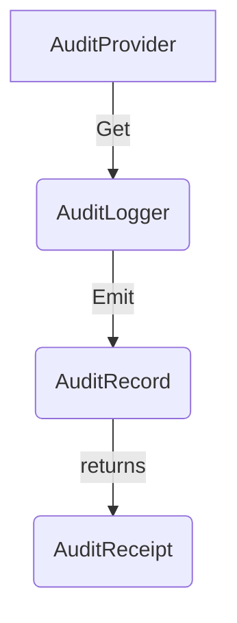

<!--- Hugo front matter used to generate the website version of this page:
linkTitle: API
weight: 1
--->

# Audit Logging API

**Status**: [Development](../document-status.md)

Table of Contents

<!-- toc -->

- [AuditProvider](#auditprovider)
  * [AuditProvider operations](#auditprovider-operations)
    + [Get an AuditLogger](#get-an-auditlogger)
- [AuditLogger](#auditlogger)
  * [Emit an AuditRecord](#emit-an-auditrecord)
- [Optional and required parameters](#optional-and-required-parameters)
- [Concurrency requirements](#concurrency-requirements)
- [References](#references)
<!-- tocstop -->

The Audit Logging API provides application code with a means to emit
[`AuditRecord`s](./data-model.md#auditrecord-definition) that are guaranteed to
reach the configured audit sink without loss or modification.

The API consists of these main components:

- [**AuditProvider**](#auditprovider) – the entry point of the API.
  Provides access to `AuditLogger` instances.
- [**AuditLogger**](#auditlogger) – emits `AuditRecord`s and returns
  an [`AuditReceipt`](./data-model.md#auditreceipt-definition).

Unlike the [Logs API](../logs/api.md), the Audit Logging API:

- Does **not** provide an `Enabled` check: audit records are always
  emitted regardless of configuration, because dropping audit records
  is prohibited.
- Does **not** accept a sampling-related configuration: the pipeline
  MUST NOT sample or drop records.
- Has `emit` return an [`AuditReceipt`](./data-model.md#auditreceipt-definition)
  as proof-of-delivery once the sink acknowledges the record.

## AuditProvider

`AuditLogger`s are obtained from an `AuditProvider`.

The `AuditProvider` is expected to be accessed from a central place.
The API SHOULD provide a way to set and access a global default
`AuditProvider`.

The API MUST provide a No-op `AuditProvider` implementation that is
used when no SDK is installed. The No-op provider MUST return a No-op
`AuditLogger` whose `emit` method completes without error and returns a
No-op `AuditReceipt`.

### AuditProvider operations

The `AuditProvider` MUST provide the following function:

- Get an `AuditLogger`

#### Get an AuditLogger

This API MUST accept the following parameter:

- `name` (required): A string identifying the component, library, or
  subsystem that is emitting audit records (for example,
  `"com.example.auth"` or `"payment-service"`). The name is used as a
  diagnostic label and is stored as an SDK-internal marker. It MUST NOT
  be empty. If an empty string is provided, the SDK SHOULD log a
  warning and use a fallback name rather than failing.

  Note: unlike `LoggerProvider.GetLogger`, this `name` is NOT mapped
  to an OTLP `InstrumentationScope`. See
  [README – OTLP Envelope Layers](./README.md#relationship-to-the-log-signal).

This API MAY accept the following optional parameters:

- `version` (optional): A string specifying the version of the
  emitting component (for example, `"1.2.3"`).
- `schema_url` (optional): A Schema URL to be recorded in emitted
  records for semantic convention versioning.

The term *identical* applied to `AuditLogger`s describes instances
where all parameters are equal. The term *distinct* describes instances
where at least one parameter has a different value.

## AuditLogger

The `AuditLogger` is responsible for emitting `AuditRecord`s to the
audit pipeline.

The `AuditLogger` MUST provide a function to:

- [Emit an `AuditRecord`](#emit-an-auditrecord)

The `AuditLogger` MUST NOT provide an `Enabled` or sampling-related
function. Conditional emission is the sole responsibility of
application code; the SDK MUST NOT silently suppress records based on
any sampling or filtering configuration.

### Emit an AuditRecord

The effect of calling this API is to submit an `AuditRecord` to the
audit pipeline and to block until the audit sink acknowledges receipt,
returning an `AuditReceipt`.

The API MUST accept the following parameters:

- [`RecordId`](./data-model.md#field-recordid) (required): a
  caller-generated unique identifier for this record. If the caller
  does not provide one the SDK MUST generate a UUID v4. The value
  MUST be stable across retries of the same event.
- [`Timestamp`](./data-model.md#field-timestamp) (required): the time
  at which the auditable action occurred.
- [`EventName`](./data-model.md#field-eventname) (required): the
  semantic name of the audit event.
- [`Actor`](./data-model.md#field-actor) (required): the identity that
  performed the action.
- [`ActorType`](./data-model.md#field-actortype) (required): the type
  of the actor (`USER`, `SERVICE`, or `SYSTEM`).
- [`Action`](./data-model.md#field-action) (required): the verb
  describing what was done.
- [`Outcome`](./data-model.md#field-outcome) (required): the result of
  the action (`SUCCESS`, `FAILURE`, or `UNKNOWN`).

The API MUST accept the following optional parameters:

- [`ObservedTimestamp`](./data-model.md#field-observedtimestamp)
  (optional): if not set, the SDK MUST set this to the current time.
- [`SchemaVersion`](./data-model.md#field-schemaversion) (optional):
  the schema version of the audit payload. SHOULD be set.
- [`TargetResource`](./data-model.md#field-targetresource) (optional):
  the object upon which the action was performed.
- [`SourceIP`](./data-model.md#field-sourceip) (optional): the source
  network address.
- [`Body`](./data-model.md#field-body) (optional): free-form additional
  event details.
- [`Attributes`](./data-model.md#field-attributes) (optional):
  arbitrary key-value context pairs.
- [`IntegrityValue`](./data-model.md#field-integrityvalue) (optional):
  cryptographic integrity proof over the record – either an asymmetric
  digital signature or a symmetric HMAC. The signing algorithm is
  configured via the `audit.integrity.algorithm` `Resource` attribute
  on the `AuditProvider`; the key reference via
  `audit.integrity.certificate`.
- [`SequenceNo`](./data-model.md#field-sequenceno) (optional):
  monotonic counter for hash-chain continuity.
- [`PrevHash`](./data-model.md#field-prevhash) (optional): SHA-256 of
  the preceding record in the audit stream.

**Return value**: The API MUST return an
[`AuditReceipt`](./data-model.md#auditreceipt-definition) when the audit sink
acknowledges that the record has been persisted. The receipt echoes the
caller's `RecordId` and contains an `IntegrityHash` and a
`SinkTimestamp`.

**Delivery semantics**: `emit` is synchronous by default. It MUST block
the calling thread until the exporter receives a successful
acknowledgement from the audit sink. This guarantees at-least-once
delivery and provides the caller with a `RecordId` that can be logged
or stored for audit trail completeness.

An asynchronous variant MAY be provided by the SDK. An asynchronous
`emit`:

- MUST still guarantee at-least-once delivery through an internal
  durable buffer.
- MUST NOT silently discard records on failure.
- MAY return a future, promise, or channel through which the
  `AuditReceipt` will be delivered once the sink acknowledges the
  record.

**Error handling**: If the audit sink cannot be reached and the SDK's
retry budget is exhausted, `emit` MUST surface a hard error to the
caller (for example, by raising an exception or returning an error
code). It MUST NOT return silently or return a partial / empty receipt.

## Optional and required parameters

Required parameters are those not marked optional in the
[Emit an AuditRecord](#emit-an-auditrecord) section. The API MUST be
structured to require these parameters (for example, as positional
arguments or a required record type).

For each optional parameter, the API MUST be structured to accept it,
but MUST NOT require the caller to provide it.

## Concurrency requirements

For languages that support concurrent execution, the Audit Logging API
provides the following guarantees:

- **AuditProvider** – all methods MUST be documented as safe for
  concurrent use.
- **AuditLogger** – `emit` MUST be documented as safe for concurrent
  use. Concurrent `emit` calls MUST be serialized internally by the SDK
  so that records are enqueued in the order they are received.

## References

- [OTEP 0267 – Audit Logging Signal](../../oteps/0267-audit-logging.md)
- [OTEP 0202 – Events and Logs API](../../oteps/0202-events-and-logs-api.md)
