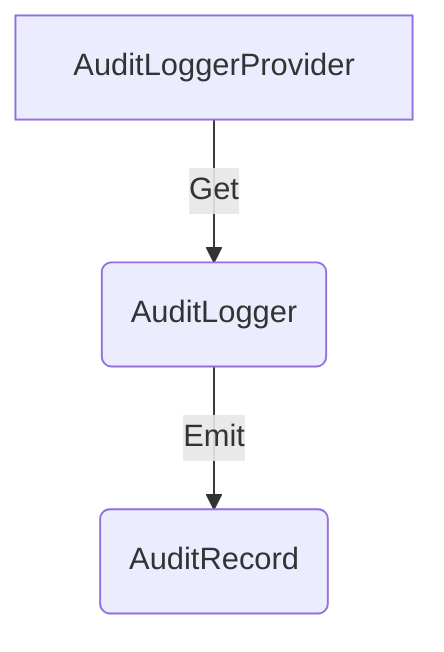

<!--- Hugo front matter used to generate the website version of this page:
linkTitle: Tier-1 API
weight: 1
aliases: [audit-bridge-api]
--->

# Audit Logs Tier-1 API

**Status**: [Development](../document-status.md)

Table of Contents

<!-- Re-generate TOC with `markdown-toc --no-first-h1 -i` -->

<!-- toc -->

- [AuditLoggerProvider](#auditloggerprovider)
  * [AuditLoggerProvider operations](#auditloggerprovider-operations)
    + [Get an AuditLogger](#get-an-auditlogger)
- [AuditLogger](#auditlogger)
  * [Emit an AuditRecord](#emit-an-auditrecord)
  * [Enabled](#enabled)
- [Optional and required parameters](#optional-and-required-parameters)
- [Concurrency requirements](#concurrency-requirements)
- [Ergonomic API](#ergonomic-api)
- [References](#references)

<!-- tocstop -->

The Audit Logs API is provided for instrumentation and logging library authors
to emit structured audit records that follow the
[Audit Logs Data Model](./data-model.md).

The API can be used directly by applications or indirectly via adapters and
bridges. Languages may provide a more [ergonomic API](#ergonomic-api) for direct
usage.

This API specifies Tier-1 behavior only (application and SDK emit path). Tier-2
collector verification and delivery behavior is out of scope for this document
and is defined in [Audit Logs Data Model](./data-model.md) and
[Audit Logs SDK](./sdk.md).

The Audit Logs API consists of these main components:

* [AuditLoggerProvider](#auditloggerprovider) is the entry point of the API.
  It provides access to `AuditLogger` instances.
* [AuditLogger](#auditlogger) is responsible for emitting
  [AuditRecord](./data-model.md#audit-log-record-definition).

## AuditLoggerProvider

`AuditLogger` instances are accessed with an `AuditLoggerProvider`.

The API SHOULD provide a way to register and access a global default
`AuditLoggerProvider`.

### AuditLoggerProvider operations

The `AuditLoggerProvider` MUST provide the following function:

* Get an `AuditLogger`

#### Get an AuditLogger

This API MUST accept the following
[instrumentation scope](../common/instrumentation-scope.md) parameters:

* `name`: Name of the instrumentation scope, such as instrumentation library,
  package, module, class, or component name.
* `version` (optional): Version of the instrumentation scope.
* `schema_url` (optional): Schema URL to record on emitted telemetry.
* `attributes` (optional): Instrumentation scope attributes associated with
  emitted telemetry.

The term *identical* applied to `AuditLogger` instances describes instances
where all parameters are equal. The term *distinct* applied to `AuditLogger`
instances describes instances where at least one parameter is different.

## AuditLogger

The `AuditLogger` is responsible for emitting `AuditRecord` values.

The `AuditLogger` MUST provide a function to:

- [Emit an `AuditRecord`](#emit-an-auditrecord)

The `AuditLogger` SHOULD provide functions to:

- [Report if `AuditLogger` is `Enabled`](#enabled)

### Emit an AuditRecord

The effect of calling this API is to emit an `AuditRecord` to the processing
pipeline.

The API MUST accept the following parameters:

- [Timestamp](./data-model.md#field-timestamp) (required)
- [ObservedTimestamp](./data-model.md#field-observedtimestamp) (optional)
- The [Context](../context/README.md) associated with the `AuditRecord`.
  When implicit Context is supported, this parameter SHOULD be optional and
  if unspecified then MUST use current Context.
  When only explicit Context is supported, this parameter SHOULD be required.
- [RecordId](./data-model.md#field-recordid) (required)
- [EventName](./data-model.md#field-eventname) (required)
- [Actor](./data-model.md#field-actor) (required)
- [ActorType](./data-model.md#field-actortype) (required)
- [Action](./data-model.md#field-action) (required)
- [Resource](./data-model.md#field-resource) (required)
- [Outcome](./data-model.md#field-outcome) (required)
- [SourceIp](./data-model.md#field-sourceip) (optional)
- [Body](./data-model.md#field-body) (required)
- [Attributes](./data-model.md#field-attributes) (required)
- [SchemaVersion](./data-model.md#field-schemaversion) (required)
- [Hash](./data-model.md#field-hash) (required)
- [Signature/Hmac](./data-model.md#field-signature--hmac) (required)

The API MAY accept the following parameters:

- [HashAlgorithm](./data-model.md#field-hashalgorithm) (optional)
- [KeyId](./data-model.md#field-keyid) (optional)
- [SequenceNo](./data-model.md#field-sequenceno) (optional)
- [PrevHash](./data-model.md#field-prevhash) (optional)

### Enabled

To help users avoid computationally expensive work when generating an
`AuditRecord`, an `AuditLogger` SHOULD provide this `Enabled` API.

The API SHOULD accept the following parameters:

- The [Context](../context/README.md) to be associated with the `AuditRecord`.
  When implicit Context is supported, this parameter SHOULD be optional and
  if unspecified then MUST use current Context.
  When only explicit Context is supported, accepting this parameter is required.
- [EventName](./data-model.md#field-eventname) (optional)

This API MUST return a language-idiomatic boolean type.

A returned value of `true` means the `AuditLogger` is enabled for the provided
arguments, and a returned value of `false` means it is disabled for the provided
arguments.

The returned value can change over time, so instrumentation authors SHOULD call
this API each time they [emit an AuditRecord](#emit-an-auditrecord) to ensure an
up-to-date response.

## Optional and required parameters

The operations defined include various parameters, some marked optional.
Parameters not marked optional are required.

For each optional parameter, the API MUST accept it but MUST NOT require users
to provide it.

For each required parameter, the API MUST require users to provide it.

## Concurrency requirements

For languages that support concurrent execution, the Audit Logs API provides
specific guarantees and safeties.

**AuditLoggerProvider** - all methods MUST be documented as safe for concurrent
use by default.

**AuditLogger** - all methods MUST be documented as safe for concurrent use by
default.

## Ergonomic API

Languages MAY additionally provide a more ergonomic and convenient API for
emitting audit records.

The ergonomic API SHOULD simplify common audit logging patterns while preserving
the core required fields and integrity semantics defined in this document.

The ergonomic API design SHOULD be idiomatic for its language.

## References

- [Audit Logs Data Model](./data-model.md)
- [Audit Logs SDK](./sdk.md)
- [OpenTelemetry Logs API](../logs/api.md)
